# MelodySound - Android Application

## 📱 Giới thiệu

**MelodySound** là ứng dụng di động được phát triển bằng **Kotlin XML** trên nền tảng **Android** kết hợp với **Spotify Web API** cung cấp, ứng dụng điều khiển ứng dụng Spotify trên thiết bị khác phát nhạc. Ứng dụng cung cấp tương đối các chức năng phát nhạc phổ biến của một nghệ sĩ, album, single,....

## 📸 Ảnh chụp giao diện ứng dụng
<table>
  <tr>
    <td>Đăng nhập bằng Spotify</td>
    <td>Đăng nhập bằng Spotify</td>
    <td>Trang chủ</td>
    <td>Podcasts</td>
  </tr>
  <tr>
    <td>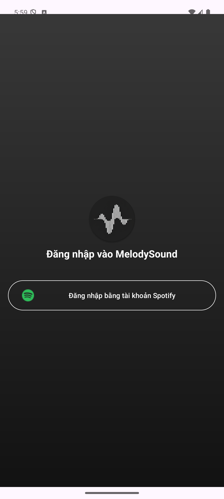</td>
    <td>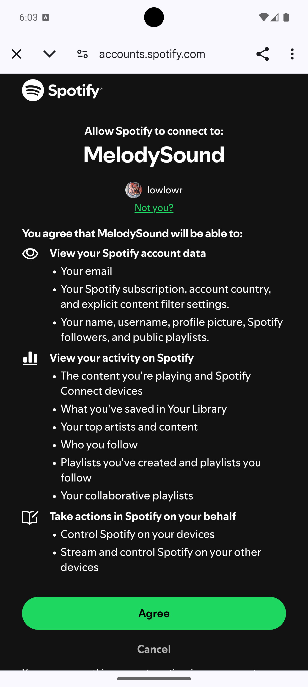</td>
    <td>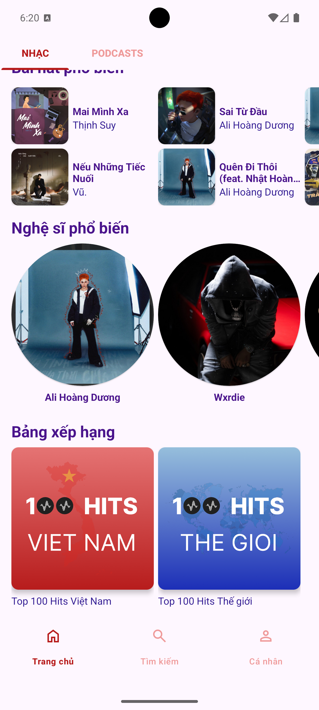</td>
    <td>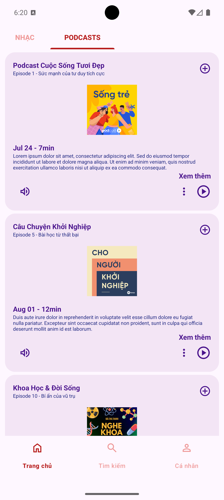</td>
  </tr>
  <tr>
    <td colspan="4"></td>
  </tr>
  <tr>
    <td>Chi tiết Album</td>
    <td>Chi tiết nghệ sĩ</td>
    <td>Chi tiết nghệ sĩ</td>
    <td>Tìm kiếm</td>
  </tr>
  <tr>
    <td>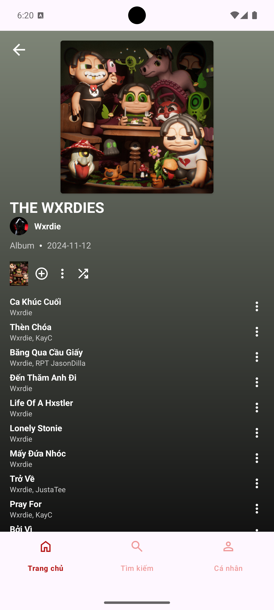</td>
    <td>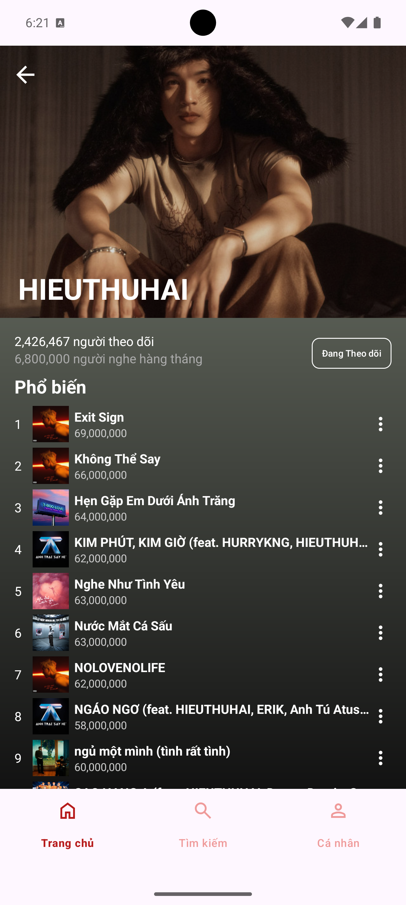</td>
    <td>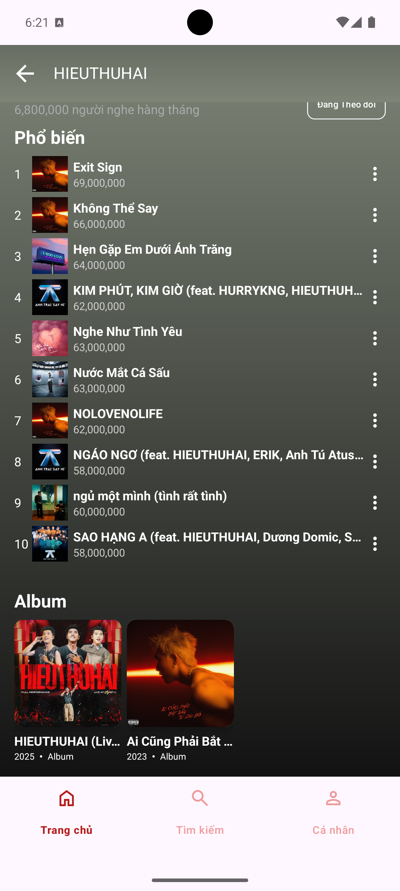</td>
    <td>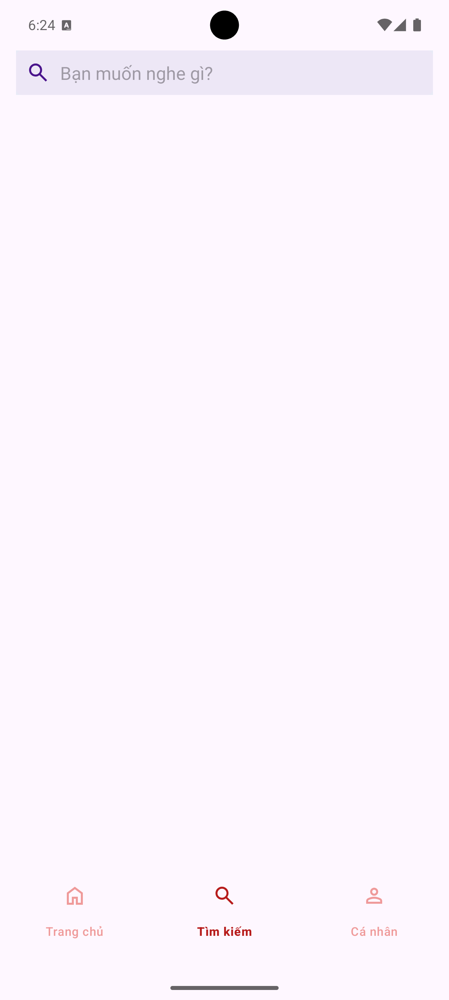</td>
  </tr>
  <tr>
    <td colspan="4"></td>
  </tr>
  <tr>
    <td>Top 100 Việt Nam</td>
    <td>Top 100 Thế giới</td>
    <td>Trang các nhân</td>
    <td>Đang theo dõi</td>
  </tr>
  <tr>
    <td>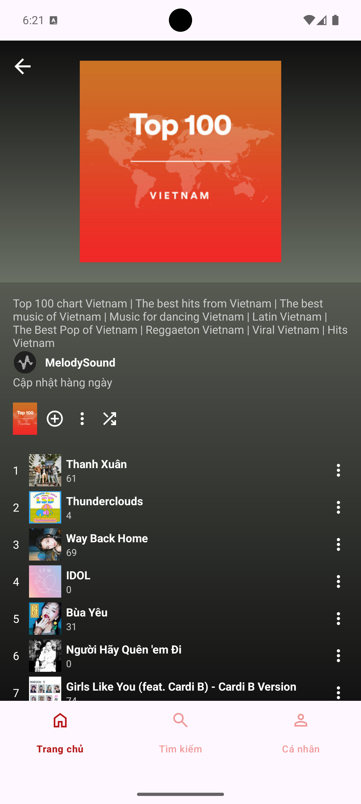</td>
    <td>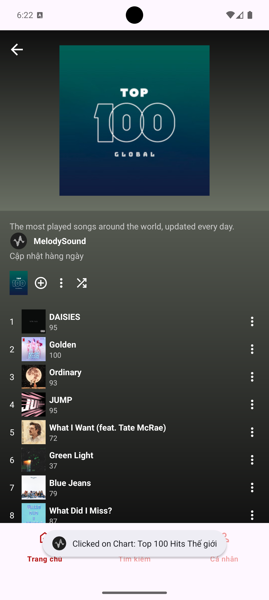</td>
    <td>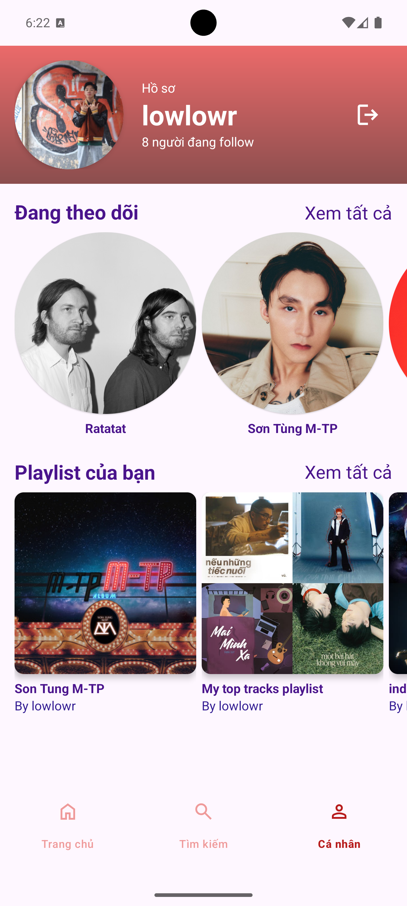</td>
    <td>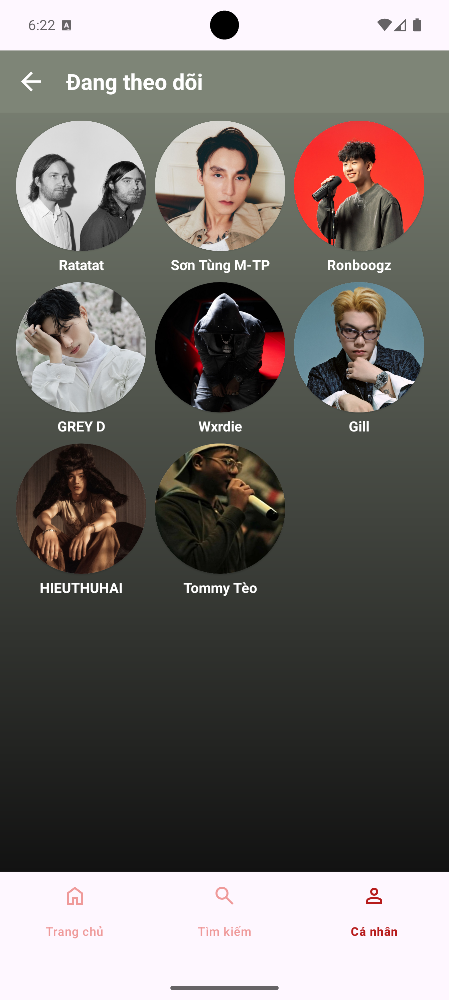</td>
  </tr>
  <tr>
    <td colspan="4"></td>
  </tr>
  <tr>
    <td>Danh sách phát</td>
    <td>Bài hát đang phát</td>
    <td>Chi tiết bài hát đang phát</td>
  </tr>
  <tr>
    <td>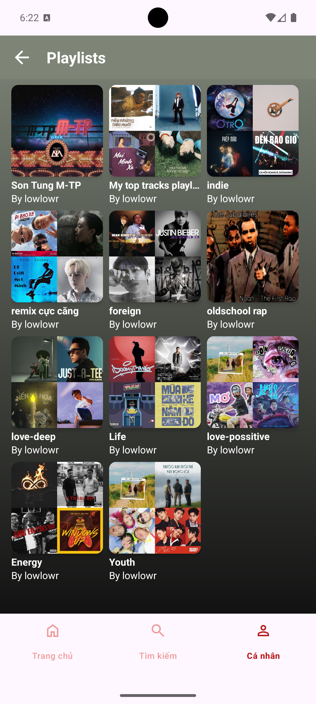</td>
    <td>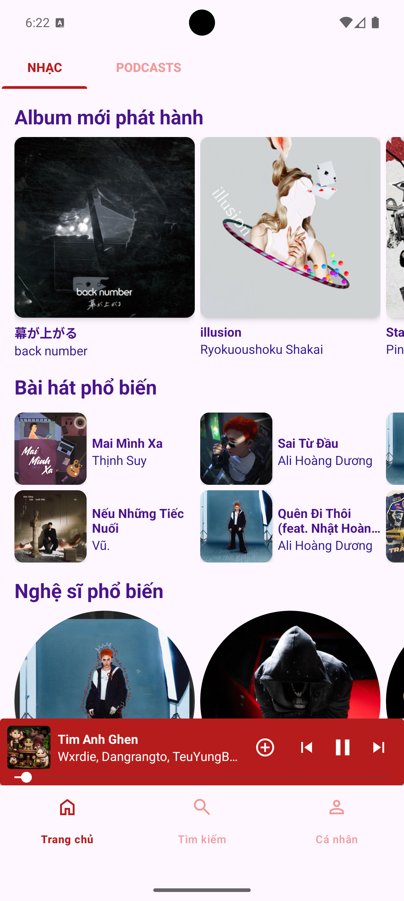</td>
    <td></td>
  </tr>
  </table>
  
## 🛠 Công nghệ sử dụng

### Android Studio
- **Ngôn ngữ**: Kotlin
- **Thư viện chính**: Retrofit, OkHttp, AndroidX Security Crypto, OAuth 2.0, Glide

### API
- Spotify Web API
  
### Công cụ hỗ trợ
- **Thiết kế UI/UX**: Figma
- **IDE**: Android Studio
- **Version Control**: Git/GitHub


## 🚀 Cài đặt và chạy ứng dụng

### Yêu cầu hệ thống
- Android Studio bản Narwhal hoặc mới hơn
- Android SDK 28+
- JDK 17+

### Các bước cài đặt
1. Clone repository:
   ```bash
   git clone https://github.com/chaolaolo/MelodySound.git
   ```
2. Mở project bằng Android Studio
3. Đồng bộ Gradle và tải các dependencies
4. Chạy ứng dụng trên máy ảo hoặc thiết bị thật


**Liên hệ với tôi**: 
- Chảo Láo Lở - [chaolaolo290604@gmail.com](mailto:chaolaolo290604@gmail.com).
- Phone: 0396471382
